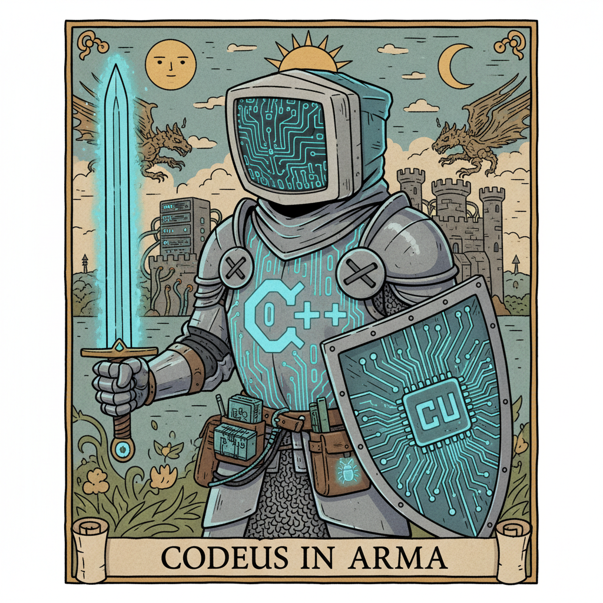

Projeto Podcast Gerado por I.A.s

Projeto com o objetivo de gerar um podcast utilizando ferramentas de IA através de prompts mais trabalhado.

💻 Tecnologias utilizadas no projeto
ChatGPT
MidJourney
ElevenLabs
Capcut

✨ Como foi feito ?
Roteiro gerado via chatgpt
Audio gerado pela elevenLabs
Midjourney Para gerar capas
Capcut para tratar aúdio e adicionar sons de fundo

📚 Materiais
[Notion Template] (https://www.notion.so/Roterista-2adf243aec358198b0f3d3a76a4f50f3)
